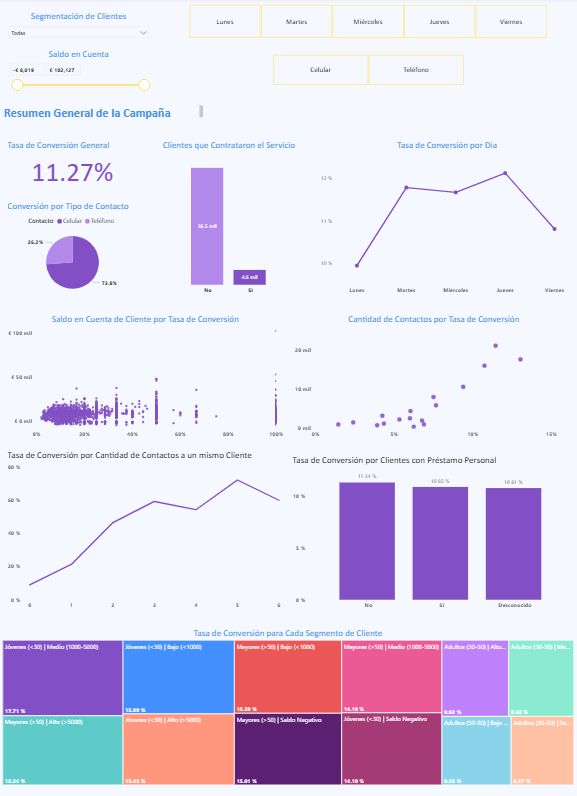
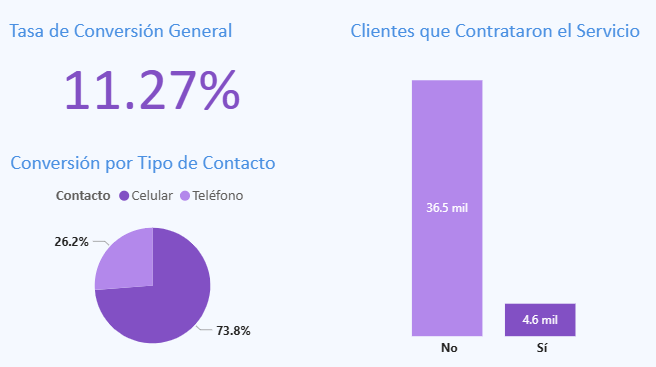
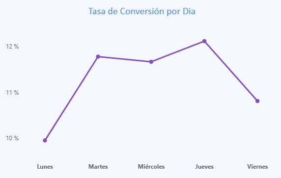
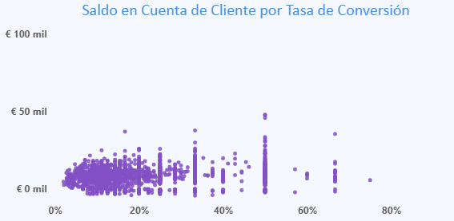
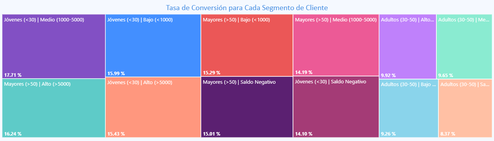

# 🏛️ Análisis de Campaña de Marketing Bancario

🔍 **Análisis descriptivo de campañas bancarias con segmentación y visualización en Power BI**

Este proyecto identifica los factores clave que influyen en la conversión de clientes a depósitos a plazo fijo, utilizando SQL para el modelado relacional y Power BI para el análisis y visualización de resultados. A partir de datos históricos de campañas de marketing telefónicas, se segmentan perfiles de clientes y se proponen estrategias comerciales accionables.

## 📖 Descripción del Proyecto

Un banco portugués realizó campañas de marketing vía telefónica. El objetivo era que los clientes contraten depósitos a plazo fijo. Para eso disponemos de información demográfica, financiera y de las interacciones con los clientes. Este proyecto busca realizar un análisis detallado de estos datos permitirá mejorar la efectividad de futuras campañas y optimizar el uso de los recursos comerciales.
## 📊 Dataset
- Fuente: [Bank Marketing Dataset - UCI](https://archive.ics.uci.edu/ml/datasets/bank+marketing)
- Registros: 41,188 clientes contactados
### Variables principales

| Variable         | Tipo         | Descripción                                 |
|------------------|--------------|---------------------------------------------|
| edad             | Numérica     | Edad del cliente                            |
| ocupación        | Categórica   | Tipo de trabajo del cliente                 |
| estado_civil     | Categórica   | Soltero, casado, divorciado                 |
| educación        | Categórica   | Nivel educativo alcanzado                   |
| saldo            | Numérica     | Saldo promedio anual en euros               |
| tipo_contacto    | Categórica   | Canal de contacto (celular/teléfono)        |              |
| día_contacto     | Categórica     | Día del mes en que fue contactado           |
| mes_contacto     | Categórica     | Mes en que fue contactado           |
| resultado        | Binaria      | ¿Contrató el depósito a plazo? (sí/no)      |

> ℹ️ **Nota**: Solo se presentan las variables más relevantes para el análisis. El dataset original incluye otras variables relacionadas a campañas anteriores y características del contacto.

## 🧰 Tecnología Usadas

## 🎯Objetivos
### General
Optimizar las campañas de marketing dirigidas a la captación de depósitos a plazo mediante el análisis descriptivo de los datos históricos y la propuesta de estrategias comerciales basadas en la segmentación de clientes.
### Específicos
1.	Diseñar y estructurar una base de datos relacional en PostgreSQL que permita almacenar, transformar y consultar los datos históricos de las campañas de marketing.
2.	Analizar de manera descriptiva las características demográficas, financieras y de comportamiento de clientes contactados en las campañas anteriores.
3.	Segmentar la cartera de clientes en grupos relevantes según su perfil y comportamiento de respuesta.
4.	Determinar los factores que influyen en la contratación de depósitos a plazo.
5.	Aplicar herramientas de Business Intelligence para proponer estrategias comerciales y recomendaciones que prioricen segmentos de clientes con mayor probabilidad de conversión.
6.	Generar visualizaciones interactivas en Power BI que faciliten la toma de decisiones estratégicas.
## ❓Preguntas de Negocio
- ¿Qué perfil demográfico tiene una mayor propensión a contratar depósitos?
- ¿Qué canal de contacto es más efectivo?
- ¿Cuál es la relación entre el número de contactos y la conversión?
- ¿Qué segmentos deberían priorizarse en futuras campañas?
- ¿Qué acciones podrían incrementar la tasa de conversión?
- ¿Influye el balance que tiene la persona en la decisión de contratar el depósito a plazo?
## 🧠 Enfoque Metodológico

El análisis se dividió en 3 etapas:
1. Modelado relacional y limpieza de datos en PostgreSQL.
2. Análisis exploratorio y descriptivo mediante Power BI.
3. Generación de segmentaciones personalizadas para evaluar el comportamiento del cliente y proponer estrategias comerciales.
## 📈 Resultados
- **Segmento con mayor propensión:** Jóvenes (<30 años) con saldo entre 1000 y 5000 euros
- **Canal más efectivo:** Celular (tasa de conversión 2.8x mayor que teléfono)
- **Tasa de conversión general:** 11.27%
- **La relación entre contactos y conversión:** A mayor número de contactos, la tasa de conversión aumenta, pero con rendimientos decrecientes
- **Segmentos con mayor probabilidad de conversión:** Los clientes con mayor propensión a contratar son jóvenes menores de 30 años o mayores de 50, siempre que cuenten con un saldo positivo. Todos los segmentos en este grupo superan el 15% de tasa de conversión.
- **Día óptimo de contacto:** Jueves
- **Relación entre saldo y conversión:** No se observa una relación lineal clara entre el saldo promedio del cliente y la probabilidad de conversión. Clientes con saldos altos no garantizan mayores tasas de contratación.

## 💡 Recomendaciones Estratégicas

### 1. 🎯 Segmentación focalizada para maximizar la conversión  
Priorizar las campañas hacia **clientes jóvenes (<30 años) con saldo medio (1000–5000 €)**, quienes presentan la **mayor tasa de conversión (17.71%)**, seguidos por **mayores de 50 años con saldo alto (>5000 €)**. Ambos segmentos superan significativamente el promedio general de conversión (11.27%)

➡️ *Acción:* Rediseñar las campañas para enfocarse en estos grupos demográficos, utilizando mensajes y ofertas personalizadas que resalten los beneficios de los depósitos a plazo fijo.

---

### 2. 📱 Optimizar el canal de contacto  
El canal **celular** es **2.8 veces más efectivo** que el teléfono fijo (73.8% vs 26.2%). Este medio debe ser priorizado en futuras campañas.

➡️ *Acción:* Redirigir recursos y personal hacia el canal celular, minimizando llamadas por teléfono fijo.

---

### 3. 📞 Definir un límite óptimo de intentos por cliente  
Aunque la conversión mejora con más intentos, **los beneficios disminuyen a partir del 4.º contacto**. Exceder los 5 intentos puede ser ineficiente.

➡️ *Acción:* Establecer una política comercial que limite los intentos a **máximo 3 o 4 por cliente**.

---

### 4. 📅 Elegir el momento adecuado para contactar  
**Jueves** presenta la **mayor tasa de conversión**. Lunes y viernes muestran resultados más bajos.

➡️ *Acción:* Concentrar las campañas entre martes y jueves, especialmente en segmentos clave.

---
### 5. 🗓️ Aprovechar estacionalidades favorables  
Marzo y diciembre presentan los picos más altos de conversión mensual. Aunque requieren más contexto para confirmar su causa (festividades, campañas específicas, etc.), podrían ser considerados como ventanas estratégicas para nuevas campañas.

➡️ *Acción:* Planificar campañas clave durante estos meses y analizar campañas anteriores realizadas en esas fechas para buscar patrones de éxito.

---

### 6. 💶 No sobrevalorar el saldo como predictor  
No hay evidencia clara de que un mayor saldo implique mayor conversión. Clientes con saldos altos no presentan ventaja significativa.

➡️ *Acción:* No utilizar el saldo como único criterio. En su lugar, aplicar segmentaciones multivariable validadas por los datos.

---

### 7. 🧾 Considerar clientes con préstamos personales  
Los clientes con y sin préstamo personal presentan tasas de conversión similares (≈11%).

➡️ *Acción:* No excluir automáticamente a clientes con préstamos personales. Evaluarlos en combinación con edad y saldo.

## 📸 Dashboard

A continuación se muestra el dashboard interactivo creado en Power BI, que permite explorar visualmente los hallazgos clave de la campaña de marketing.

🛠 El archivo editable en formato `.pbix` se encuentra en la carpeta [`/powerbi`](./powerbi), permitiendo modificar o extender el dashboard según nuevos requerimientos.

🔗 Puedes acceder al dashboard interactivo en línea desde Power BI Service [aquí](https://app.powerbi.com/links/0FKQe5ApcC?ctid=c6259f2e-86a0-426b-95e0-6ce33cae175f&pbi_source=linkShare) *(requiere conexión a internet y puede demorar en cargar)*.

### 🖼️ Vista general del dashboard

---

### 🔍 Vistas detalladas

#### Conversión general y por canal

#### Conversión por día

#### Relación entre saldo y conversión

#### Segmentación de clientes

## 🗂️ Estructura del Repositorio
- sql/ → consultas y modelo relacional en PostgreSQL
- images/ → capturas del dashboard
- powerbi/ → archivo editable .pbix
## 👤 Autor  
Angel Romani Tafur  
Data Analyst Jr.

📧 angelromanit@outlook.com  
🔗 [Angel Romani Tafur](https://www.linkedin.com/in/angel-romani-tafur-a584ab1bb/)  
📸 [@angelromanit](https://www.instagram.com/angelromanit/)